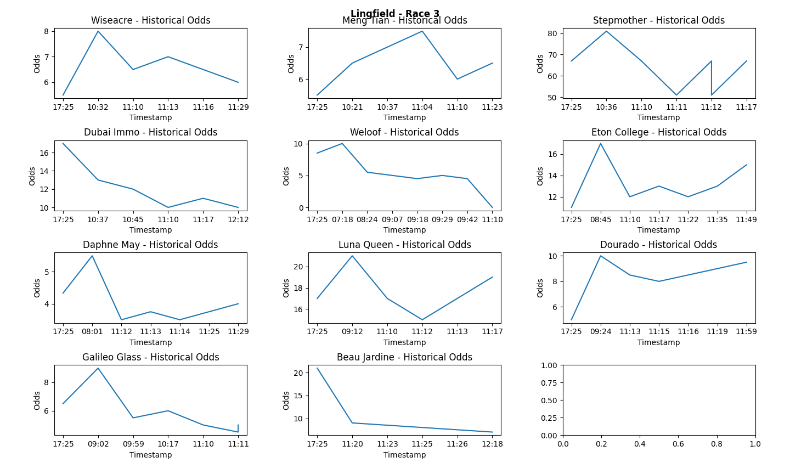

A Unibet Web Scraper for fetching horse racing odds from Unibet

## CLONE THE REPOSITORY
```bash
git clone https://github.com/BowTiedBettor/unibet.git
```

## INSTALL REQUIREMENTS
```bash
pip install -r requirements.txt
```

## USING THE SCRAPER
The scraper can be used as follows: 
- Add an EMAIL_ADDRESS & an EMAIL_PASS [special key obtained from e.g. Gmail] to the /unibetscraper/scraper.py file, emails will be delivered from this address.
- Create a local Excel file named "unibetodds.xlsx", with one sheet named "Unibet - W&P" and a second one named "Unibet - H2H". Store it
on your Desktop.
- Visit the collectodds.py script, decide on the six variables at the top of the file [add email recipients] -> run the program.
- Use the plotting functions to display odds movements.



[Visit BowTiedBettor for more content](https://www.bowtiedbettor.com)

[Follow us on Twitter](https://twitter.com/BowTiedBettorII)
